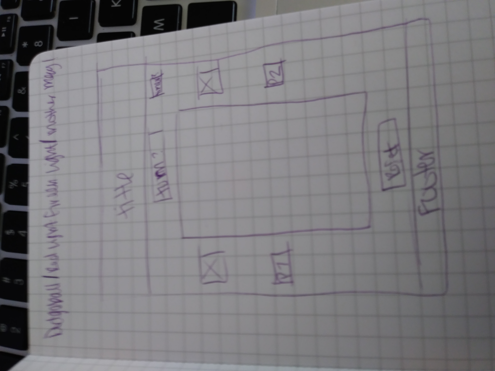

For my project, I am thinking of something similar to the racer game. But maybe, one player against the computer. Haven't decided on that bit yet. And I want to put in random landmines throughout the course. I've also thought about scoreboards, timers, working reset button, and a player button that shows life left or some aspect like that.
Trello: https://trello.com/b/g3q2QUdr/project-1

-think about difficulty level or just one level of ease(?) OR OR OOORRR different amounts of time. 10sec 30sec 45 sec 
and maybe different sizes of grids
-Game: start, stop, timer, reset
-Board: draw board out, plantMines throughout, calculateDistance, traverse, reveal, gameOver
-Field: element, x, y, flagged, revealed, mine, empty, 
-both players go at same time/both want to reach finish/no need for timer bc based on distance (if oodles of time, make timer for funsies)
-bombs randomized
-forcing both players to move forward with JS (setInterval(stuffToDo, seconds b/n))
-ok, i just fixed the alignment of my page. I'm starting on my characters...those little fuckers better fit.
-added plain css
-got my characters in
-set timeout for start of game(setInterval kept re-starting and wouldn't shut up)
-aiming to assign keys to players now.
